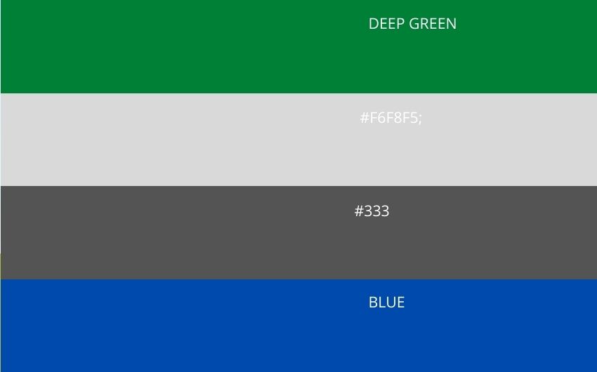

<h1 align="center">Speaky!</h1>
<h2 align="center"> Interactive  Frontend Development  Milestone Project 2 for Code Institute.</h2>


### Display from different screen shots

  [ 👁 View the live project here.](https://atinos31.github.io/Speaky/)
---
This is a text to speech application created mainly for non verbal children with learning issues.
Its main goal is to help families to better understand the basic needs and feeling of their children in real time thereby simplifying their daily lives.
* I used SpeechSynthesis interface of the Web Speech API to retrieve information about the synthesis voices available on the device .
* It is compartible with most browsers except internet explorer, Opera android and webview android.
 


# Table of contents

- [UX](#ux)
  - [Website Owner Business goals](#website-owner-business-goals)
  - [User Goals](#user-goals)
     - [New User Goals](#new-user-goals)
     - [Returning visiter Goals](#returning-visitor-goals)
     - [Website Owner Business Goals](#website-owner-business-goals)
   - [User Stories](#user-stories)
   - [Website Structure](#website-structure)
   - [Wireframes](#wireframes)
   - [Surface](#surface)
- [Features](#features)
- [Technology](#technology)
- [Testing](#testing)
    - [Fuctionality](#functionality)
    - [Compartibility](#compartibility)
    - [Code Validation](#code-validation)
    - [User Stories Testing](#user-stories-testing)
    - [Known Bugs](#known-bugs)
    - [Perfomance Testing](#performance-testing)
- [Deployment](#deployment)
- [Credits](#credits)
- [Aknowledgements](#aknowledgements)

# UX

## Website Owner Business Goals
- The main reason of creating this app is to help non verbal special needs children communicate with their friends and family in an easy way about their basic needs and feelings in real time.
- Users can find useful descriptive content to help them express their feelings.
- Users can interact by touching a photo.
- Users can get feedback in form of a voice expressing what they need.
- Users can choose their preferred voice.
- Users can type in their feelings ,needs and wants.

## User Goals

### New User Goals
- As a first time visiter, i want to be able to find relevant information fast and navigate easily to find necessary content.
- As a first time visitor i want to be able to understand the main role of the app.
- As a first time user i want to be able to choose the voice that suits me.
- As a first time user i want to be able to write down my emotions.
- As a first time user i wan to be able to hear  voice feedback after typing in my needs.
- As a first time user i wan to be able to choose any photo to communicate my needs in real time.


### Returning User Goals

- As a returning visitor i want to be able to leave feedback regarding what improvements could be implemented.

## Website Structure
  - The website is designed to be easy to navigate and user friendly on all device types but its mainly designed for  mobile and tablettes.
  - Users can  can easily interact  using the buttons and selecting images.
  - users can type in their feeling and emotions in real time.
  - Users can leave feedback on what they liked and what they could propose to be improved on.


## Wireframes

As part of the design process, before starting the project i made initial wireframes using balsamique. Creating these wireframes helped me plan the basic structure and arrangement of the features for the app.
> there are some slight changes on the real site to improve the user experience.
- Mobile wireframe 
- Tablette wireframes
-  Desktop wireframe


## Surface
 A simple clean design with easy to use buttons to handle the navigation throughout the app.


 #### Color Scheme
 * I chose to go with a subtle  but fresh color scheme that is easy on the eyes.


## Typograghy
 * The main font used throughout the site is 'Lato'. The font is clean and elegant, making it a good choice for web design.

- I have used the 'Abril+Fatcae' font for titles and headers all over the site.

- Sans Serif is set as the fallback font if for any reason the main fonts aren't being imported into the site correctly.

         
```html
    <link href="https://fonts.googleapis.com/css2?family=Abril+Fatface&family=Lato:wght@300&display=swap">

```

### Images
 All images used are from [pixabay.com](https://pixabay.com/) and have been compressed using [tinypng.com](https://tinypng.com/)


# Features
   
   * A user-friendly interface with easy navigation throughout the site
   * Attractive, minimalistic design with visuals and information presented clearly and concisely.

   * Easily readable fonts and simple navigation throughout the site.
   * brand logo to link back to the homepage.

  
- **Buttons**
    - Clear interactive buttons used for a effortless user journey.

## Navigation Bar 
*  The Navigation bar set to sticky position is visible at the top for each section, Its fully responsive and changes to a humburger menu once on mobile devices.
* Navigation Scheme On the left side there is a logo and it can be used a nav link to the home section.
* The header at the center top of the page and it is meant to be remain at a fixed position as the logo
* The button to choose voice is on the right top of the page.

## Main 
### The main are consists of two sections:

 #### 1.Type section
  - In this section , for the children that can write, they may type their emotions, feelings and wants in real time . As i could not include all the imaginable feelings wants and emotions. i thought it best to include this section.

#### 2. Image, text section
  - In this section, its more to do with visualisation. the child is able to choose what they feel or want , and in return a voice feedback is played therby the parent can understand what they need.
## Footer
 The footer is positioned at the bottom of the page and it contains:

  * feedback link - this leads to a new page with a form that can be filled to leave feedback.
  * A speaky logo that leads back to the main page when clicked, although on small screens its set to display none and a link to go back to the home page is displayed.
  * Social media links
  * Copyright with a github link in it.


## Future Features
1. In the future , the app can have different languages implemented.


## Technologies Used
### Languages Used

- [HTML5](https://en.wikipedia.org/wiki/HTML5)
- [CSS3](https://en.wikipedia.org/wiki/Cascading_Style_Sheets)
- [JavaScript](https://en.wikipedia.org/wiki/Cascading_Style_Sheets)


### Frameworks, Libraries & Programs Used

1. [Bootstrap 4.4.1:](https://getbootstrap.com/docs/4.4/getting-started/introduction/)
    - Bootstrap was used to assist with the responsiveness and styling of the website.
2. [Google Fonts:](https://fonts.google.com/)
    - Google fonts were used to import the 'Fatface & Lato Web' font into the style.css file which is used on all pages throughout the project.
3. [Font Awesome:](https://fontawesome.com/)
    - Font Awesome was used For website logo to add icons for aesthetic and UX purposes.
4. [GitHub:](https://github.com/)
    - GitHub is used to store the projects code after being pushed from Git.
5. [Balsamiq:](https://balsamiq.com/)
    - Balsamiq was used to create the wireframes in the beginning of the design process.
6. [canva](https://www.canva.com/)
    - Canva was used to create the color scheme.
7. [Vsc](https://www.canva.com/)
    - visual studio code was used as a code editor
8. [hover min css](https://ianlunn.github.io/Hover/)
   - hover min css was used as a hover effect on the social links in the footer.


# Testing
## [Html validator](https://validator.w3.org/)
## [CSS validator](-https://validator.w3.org/)
## [JSlint](https://www.jslint.com/)


## Code Validation
The W3C Markup Validator and W3C CSS Validator Services were used to validate every page of the project to ensure there were no syntax errors in the project.

-   [W3C Jigsaw html validator](http://jigsaw.w3.org/css-validator/check/referer (for HTML/XML document only)) - [passed Results](https://validator.w3.org/nu/#textarea) 
-   [W3C CSS Validator](http://jigsaw.w3.org/css-validator/check/referer (for HTML/XML document only)) - [passed Result](assets/images/validated-css.png)
-   [Jslint](https://www.jslint.com/) - [no major warning]()

### User stories testing
 - A user can choose the preferred voice to use with the app.
 - A user can type their emotion and in return get an audio feeback.
  - A user can tap on the images and in return get an audio feedback with each specific image.
  - A user can leave feedback.
### Performance Testing
   - I ran [lighthouse](https://developers.google.com/web/tools/lighthouse/) tool to check for performance, accesibility, SEO and best paractices.

     

### Further Testing

-   The app was tested on Google Chrome, firefox,
-   The app was viewed on a variety of devices such as laptop, iphones
-   Friends  were asked to review the app and documentation to point out any bugs and user experience issues.

### Known Bugs
 - submit button still needs to be reconfigured- -solved
 - responsiveness on desktop size screens.
 - voicechange function not working on iphone8....more testing needed
 - voice options.
 - confirmation message after submit button pressed, having touble with that.- ## solved
# Deployment

### GitHub Pages

The project was deployed to GitHub Pages using the following steps...

1. Log in to GitHub and locate the [Speaky](https://github.com/Atinos31/Speaky)
2. At the top of the Repository (not top of page), locate the "Settings" Button on the menu.
3. Scroll down the Settings page until you locate the "GitHub Pages" Section.
4. Under "Source", click the dropdown called "None" and select "Master Branch".
5. The page will automatically refresh.
6. Scroll back down through the page to locate the now published site [link](https://github.com/Atinos31/Speaky) in the "GitHub Pages" section.

### Forking the GitHub Repository

By forking the GitHub Repository we make a copy of the original repository on our GitHub account to view and/or make changes without affecting the original repository by using the following steps...

1. Log in to GitHub and locate the [Speaky](https://github.com/Atinos31/Speaky)
2. At the top of the Repository (not top of page) just above the "Settings" Button on the menu, locate the "Fork" Button.
3. You should now have a copy of the original repository in your GitHub account.

### Making a Local Clone

1. Log in to GitHub and locate the [Speaky](https://github.com/Atinos31/Speaky)
2. Under the repository name, click "Clone or download".
3. To clone the repository using HTTPS, under "Clone with HTTPS", copy the link.
4. Open Git Bash
5. Change the current working directory to the location where you want the cloned directory to be made.
6. Type `git clone`, and then paste the URL you copied in Step 3.

```
$ git clone https://github.com/YOUR-USERNAME/YOUR-REPOSITORY
```

7. Press Enter. Your local clone will be created.

```
$ git clone https://github.com/YOUR-USERNAME/YOUR-REPOSITORY
> Cloning into `CI-Clone`...
> remote: Counting objects: 10, done.
> remote: Compressing objects: 100% (8/8), done.
> remove: Total 10 (delta 1), reused 10 (delta 1)
> Unpacking objects: 100% (10/10), done.
```

Click [Here](https://help.github.com/en/github/creating-cloning-and-archiving-repositories/cloning-a-repository#cloning-a-repository-to-github-desktop) to retrieve pictures for some of the buttons and more detailed explanations of the above process.

## Credits
 
 * I used code institute student template to begin this project[ gitpod full template](https://github.com/Code-Institute-Org/gitpod-full-template)

### Code

-    [W3schhool](https://www.w3schools.com/default.asp)

-    [StackOverflow posts](https://stackoverflow.com) 

-   [Bootstrap4](https://getbootstrap.com/docs/4.4/getting-started/introduction/): Bootstrap Library used throughout the project mainly to make site responsive using the Bootstrap Grid System.

- [MDN WEB DOCS](https://developer.mozilla.org/)

### Acknowledgements

-   My Mentor for continuous helpful feedback.
-   Full stack Wattsapp group for the positive feeback and encouragement.
-  Slack for peer code review feeback
